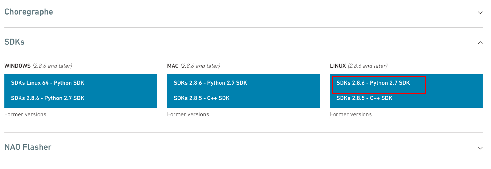

## 💻 System Setup

### NAO Setup

1. Follow this [Documentation](http://doc.aldebaran.com/2-8/family/nao_user_guide/index.html) to `Turn On` your NAO robot, and get the `robot_ip`.

2. Create a conda environment using `python 2.7`. Nao python SDK isn't compatible with other python versions.

    ```
    conda create -n nao python=2.7
    conda activate nao
    ```
3. Install necessary packages in the `nao` environment

    ```
    pip install -r nao_requirements.txt
    ```

### NaoQi Installation

1. Download NaoQi Python SDK from: https://www.aldebaran.com/en/support/nao-6/downloads-softwares. Rename the SDK with a short name -- e.g. `python-sdk`. Check the following image for `ubuntu` OS.



3. Set the following `path-variables` in the `nao` environment to install NaoQi. First, activate the `nao` environment and then run the following commands in the terminal one by one.

    ```
    export PYTHONPATH=${PYTHONPATH}: /<path-to-python-sdk>/lib/python2.7/site-packages 
    export DYLD_LIBRARY_PATH=${DYLD_LIBRARY_PATH}: /<path-to-python-sdk>/lib
    export QI_SDK_PREFIX= /<path-to-python-sdk>/
    ```

4. Run the `test_nao.py` to check if your nao is working fine!  Before that write your nao `robot_ip` in the code.

### LLM Environment Setup

1. Create account in [OpenAI](https://platform.openai.com/docs/overview) and get an API_KEY.

2. Create a conda environment using `python 3.x`. OpenAI API requires `python 3.x`

    ```
    conda create -n llm python=3.10
    conda activate llm
    ```
3. Install necessary packages in the `llm` environment

    ```
    pip install -r llm_requirements.txt
    ```

4. Set the `OPENAI_API_KEY` variable in the terminal.

    ```
    export OPENAI_API_KEY= "<YOUR_OPEN_AI_API_KEY>"
    ```

5. Run the `test_llm.py` to check if your API is working!


### Quickstart
1. Activate the two conda environments - `nao`, `llm` in two different terminals.

2. In `nao` terminal run `nao_client.py`.

    ```
    python nao_client.py
    ```

3. In `llm` terminal run the `text_chat.py` and start a text-based conversation with your NAO!

    ```
    python text_chat.py
    ```


### Full Conversation
1. Install a python package for speech to text conversion (e.g. `SpeechRecognition`)

    ```
    sudo apt-get update
    sudo apt-get install python3-dev portaudio19-dev
    pip3 install pyaudio
    sudo apt-get install flac
    pip install SpeechRecognition
    ```

3. In `llm` terminal run the `voice_chat.py` and start a voice-based conversation with your NAO!

    ```
    python voice_chat.py
    ```